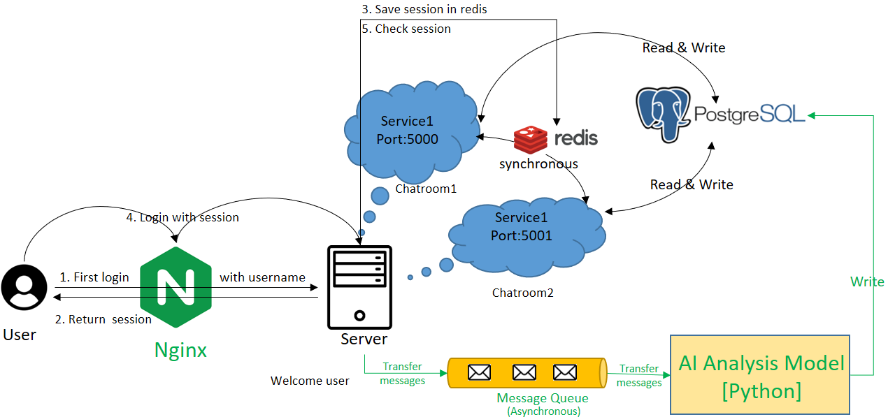

# 多人聊天室專案說明

使用 **Node.js + Express + Socket.IO** 作為後端，前端使用 **React + TypeScript + Vite**，實現多人即時聊天。

---

##  Prometheus + Grafana 實現視覺化監控 - 2026/01/08

- 透過 Prometheus 和 Exporter 搜集 Nginx, Redis, PostgreSQL 的資訊。
- 利用 Grafana 獲取 Prometheus 的資訊後進行資料視覺化。

##  Docker 容器化技術，實現環境一致性與快速部署 - 2025/12/23

- 將 Frontend (Nginx)、Backend、PostgreSQL 與 Redis 全部容器化，避免「在我的電腦可以跑，在別人的不行」的問題。
- 使用 Docker Compose 進行編排：透過 `docker-compose.yml` 一鍵啟動所有服務，自動管理容器間的網路連接。

## 加入PostgreSQL，實現訊息永久保存和使用者控管 - 2025/12/09

- 訊息寫入Table，永久保存資訊
- 透過Users表進行使用者控管，只允許表內的使用者進入
- 實現訊息歷史查詢或其他訊息分析

## 加入Redis，實現資訊共享Session管理 - 2025/11/30

- Pub/Sub 機制，在多伺服器之間共享訊息
- 儲存 Session ， 提升使用者體驗
- 透過 Set 資料結構，紀錄使用者姓名避免重複登入
 

## 加入Nginx，實現反向代理和流量控制 - 2025/11/15

- 多一個backend2是為了測試Nginx的流量控制。
- frontend裡面多一個dist是因為把前端打包後要給Nginx使用
- Nginx安裝好後，只修改了/conf/nginx.conf即可，因此不把Nginx資料夾一起上拋

